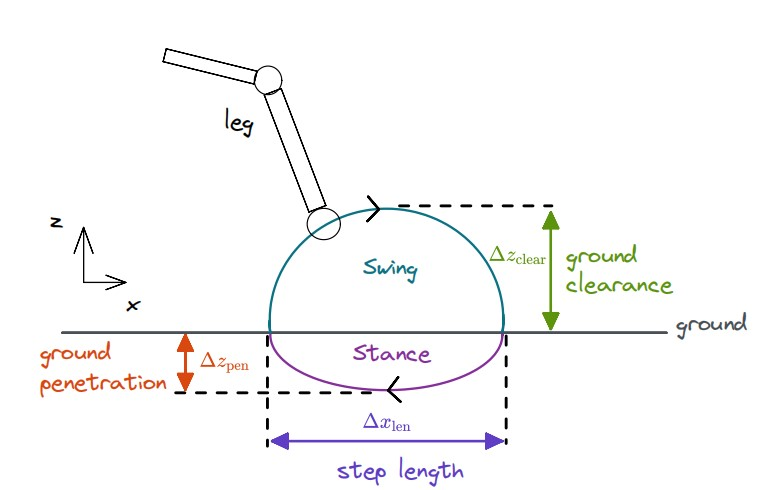
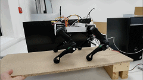
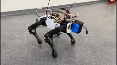

# spotMini_make_walk_training

### Project Overview

The SpotMini Quadruped Robot project is a culmination of cutting-edge technologies aimed at creating a highly capable and adaptable quadruped robot. 

@@恰一张站立然后姿态控制的图

#### **Mechanical Design and Fabrication**

 I've meticulously designed and 3D printed each part of the quadruped robot, ensuring precision and robustness. This step involved careful consideration of the robot's physical structure to support its weight, balance, and range of motion.

About how to assemble the robot refer to this link https://spotmicroai.readthedocs.io/en/latest/.

Raspberrry Pi 4b

Motor type Hiwonder  HTS-35

IMU JY901B  ( 9-aixes )


@@ 实物连接图

#### Kinematic Pose Control

I've implemented sophisticated kinematic algorithms that enable precise control over the robot's poses. This includes the ability to control joint angles, mimic animal-like movements, and achieve stable standing positions.

##### Calculation

robot kinematic refer to https://www.researchgate.net/publication/320307716_Inverse_Kinematic_Analysis_Of_A_Quadruped_Robot




@@恰一张仿真和实际的图


##### Self-Balancing Mechanism

One of the highlights of the project is the self-balancing capability of the robot using pid control. Through a combination of sensors, actuators, and control algorithms, the robot can maintain its balance even on uneven surfaces, showcasing its agility and adaptability. 

you can also refer to my another repository https://github.com/BruceXing24/quadruped_pose, and the simulation video is in https://www.bilibili.com/video/BV1HG4y157Ct/.

Here for spot_mini I just do one asix testing. 



#### **Walking and Locomotion:**

The culmination of the project's efforts is the achievement of walking and dynamic locomotion. By implementing advanced gait generation techniques and motion planning algorithms, the robot can perform a variety of walking patterns with different speeds and styles.

@@ 恰一张 轨迹曲线 和仿真中的曲线




#### Reinforcement Learning (RL) Training

To elevate the robot's autonomy and adaptability, I've employed Reinforcement Learning techniques. By setting up a reward system and using RL algorithms, the robot learns to optimize its actions, further enhancing its ability to navigate its environment and perform complex tasks.

Here using stable baseline3 and gym library to implement RL. 恰几张训练的图片


### How to run 

- ROS Humble
- Pytorch
- Pybullet
- Gym
- Numpy

All packages can be build in colcon build.

spotMini_driver is used to launch the robot motor, motor control board and IMU. 

```shell
ros2 launch robot_state robot_state.launch.py
```

if you want try using RL model as a optimizer you can try

```shell
ros2 launch robot_state ppo_control.launch.py
```

sadly my sim works but sim to real failed...

spotMini_controller is used to calculate all kinematic and publish motor angle command to motor control board.

```shell
ros2 launch spot_controller spot_controller.launch.py
```

here show3D graph is built in matplotlib , about the rpy information you can subcribe to imu data(actual value ) or the theoretical calculation value from pose calculation.

@@掐一张spot_controller 启动界面


spotMini_training 

this package provide a example how to configure reinforcement learning with gym and stablebaseline3 library.

- action space

  The task at hand involves controlling a system with four legs, and the action space is defined as an 8-dimensio2nal vector. Each dimension corresponds to the angles of the thigh and knee joints of one of the four legs.

- observation space

- The observation space in training environment comprises of the proprioceptive sensory information which can be computed by sensors and state-estimators on the physical system. For the task of corrective motor output angles, which utilize an exteroceptive feedback from the IMU. The proprioceptive state information consists of a compact 11 dimensional vector defined as , where 


- reward function 


- online correction

@@掐一张online correction 图片

